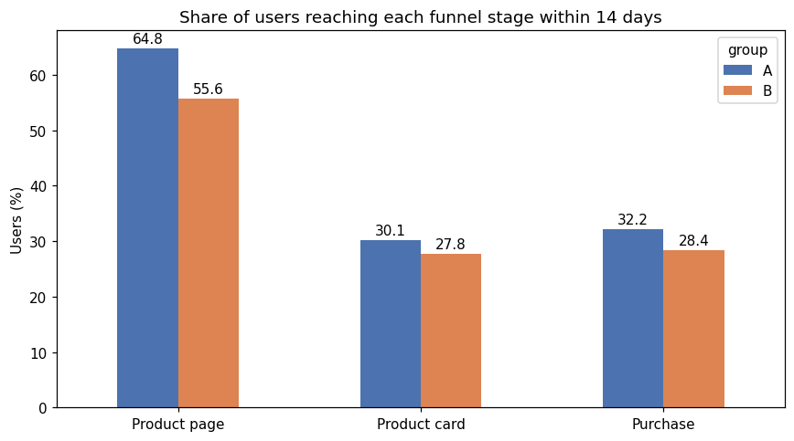

# Evaluating a New Recommender System with an A/B Test

## Overview

An international online store launched an A/B test of an improved recommendation system, but the analyst responsible left before analysing it. This project audits whether the test was run according to its specification and then evaluates its results. The test was expected to raise conversion by at least 10% at each stage of the purchase funnel within 14 days of a user signing up.

## Data

The analysis uses four tables: the test participants and their groups, the sign-up date, region and device of each new user, a log of 423,761 user actions (logins, product page views, product card views and purchases), and the company's calendar of marketing campaigns. The test enrolled new users between 7 and 21 December 2020.

## Approach

The analysis first checks the validity of the test: overlap with a concurrent experiment, the audience and enrolment rate, the balance between groups, and the observed test period. It then measures, for each group, the share of users who reached each funnel stage within 14 days of sign-up, and compares the groups with two-proportion z-tests using a Bonferroni correction for multiple comparisons. A power analysis assesses whether the test was large enough to detect the intended effect, and a robustness check repeats the analysis under a stricter exclusion rule.

## Key Findings

| Funnel stage | Group A | Group B | Relative change | Significant after correction |
|---|---|---|---|---|
| Product page | 64.8% | 55.6% | −14.1% | Yes |
| Product card | 30.1% | 27.8% | −7.8% | No |
| Purchase | 32.2% | 28.4% | −11.8% | No |

The new recommendation system did not deliver the expected improvement. Users who received it were significantly less likely to view product pages, and there is no evidence of an improvement at any stage.

The test itself, however, was seriously flawed. Group B received only 25% of participants instead of half, a sample ratio mismatch that indicates a fault in group assignment (chi-square p < 0.001). A quarter of participants were simultaneously enrolled in another experiment, only 8.8% of new EU users were enrolled instead of the specified 15%, the sample reached 3,675 users instead of 6,000, and the data ends before the planned finish date. As a result, the test had only about a 20% chance of detecting a genuine 10% improvement in purchases.

## Recommendation

The new system should not be rolled out in its current form, because the significant drop in product page views is a clear warning sign. The company should investigate that drop, fix the group assignment mechanism, and rerun the test without overlapping experiments, outside major holiday promotions, and with a sample size calculated in advance to give at least 80% power for the purchase stage.

## Skills Demonstrated

This project demonstrates experiment validation, including sample ratio mismatch testing and contamination checks, funnel analysis at the user level, hypothesis testing with multiple-comparison correction and confidence intervals, statistical power analysis, and robustness checks.

## How to Run

Install the dependencies with `pip install -r requirements.txt` and open `ab_testing_recommender_system.ipynb` in Jupyter. The four data files are included in the repository.

## Tools

Python, pandas, NumPy, SciPy, statsmodels, Matplotlib and Jupyter Notebook.
